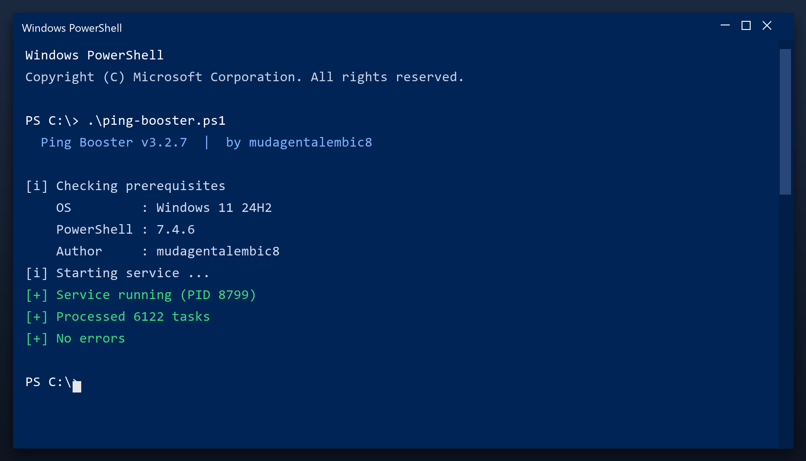

# Ping Booster — Free Download [2026]

  

  

**Ping booster** is a maintenance tool for Windows written to be simple: one window, plain settings, no confusing options. Download it, run a scan, done. **Free to use, no strings attached.**

## Overview

Ping booster does three things: it finds junk files, it finds broken settings, and it removes them. That is the whole tool - no social features, no accounts, no ads. It runs as a normal Windows program and works fully offline after you download it.

| **Term** | **Meaning** |
| --- | --- |
| **Junk** | Files no program needs any more |
| **Broken entry** | A setting that points to nothing |
| **Cache** | Temporary data stored for speed |
| **Offline** | Works without an internet connection |

## The Problem

- **Slow performance** - too many background programs start with Windows
- **Cluttered disk** - temporary files and leftovers build up over time
- **Registry errors** - broken entries cause errors and crashes
- **Hard to find settings** - Windows hides the useful options
- **Bundled junk** - many free tools install adware or toolbars

## How It Fixes It

| **Problem** | **Solution** |
| --- | --- |
| **Low disk space** | Free up space safely |
| **Freezes and errors** | Repair system entries |
| **Manual cleaning** | One-click maintenance |
| **Fake tools** | Tested build on this page |
| **Hard to use** | Simple, plain settings |

## Install

1. **Get the file** with the button below
2. **Allow** it in Windows SmartScreen (More info, Run anyway)
3. **Open** the tool
4. **Press Start scan** and wait a couple of minutes
5. **Click Clean** to remove what was found

  

> **Note:** make sure your work is saved before a deep clean. The tool creates a restore point, but saving first is always wise.

## Features

| **Feature** | **Details** |
| --- | --- |
| **Supported systems** | Windows 10 and 11 |
| **Scheduling** | Optional automatic scans |
| **Undo** | Restore point created first |
| **Interface** | Simple, plain English |
| **Safety** | Scanned and tested build |
| **Version** | Current 2026 release |

## Requirements

| **Component** | **Requirement** |
| --- | --- |
| **Operating system** | Windows 10 or newer |
| **Processor** | Any x64 CPU |
| **Memory** | 2 GB or more |
| **Storage** | 100 MB free |
| **Display** | 1024x768 or higher |

## What's Included

| **Component** | **Details** |
| --- | --- |
| **Program** | Tested, clean build |
| **Instructions** | Quick start guide |
| **Requirements** | Listed below |
| **License** | Free for personal use |

## Compared With Alternatives

| **Feature** | **Big-name suites** | **ping booster** |
| --- | --- | --- |
| **Size** | Hundreds of MB | Small |
| **Ads in app** | Common | None |
| **Upsells** | Constant | None |
| **Background tasks** | Always on | Only when open |

## Tips

- Start with a quick scan before a deep scan
- Deep scans take longer but find more
- Check free space before and after
- Note any errors and check the FAQ
- Repeat monthly for consistent speed

## Troubleshooting

| **Issue** | **Fix** |
| --- | --- |
| **Windows warns about the file** | Click More info, then Run anyway |
| **Slow first launch** | Normal - it indexes on first run |
| **Scan finds nothing** | Good - your PC is already clean |
| **Settings do not save** | Run as admin once so it can write config |

## FAQ

**Do I need to be technical?**

No. It shows plain buttons and a clear report - no settings to understand.

**Will it slow my PC while running?**

Only during a scan. It throttles itself when you are using the computer.

**Does it run in the background?**

No. It only works when the window is open.

**Can I undo a cleanup?**

Yes - a restore point is created before any change.

**Is there a paid version?**

No. Everything is included and free.

## Summary

**Ping booster** is a small, honest Windows utility. It cleans what should be cleaned, shows you what it found, and leaves everything else alone.

- No adware, no upsells
- No account needed
- Runs only when you open it
- Free 2026 build

**Get it from the button above.**

---

*resonant-reef-947 · Updated 2026-10-09 · Shared under the MIT License*
